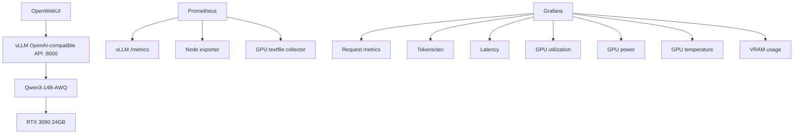

NOVALAB AI INFRASTRUCTURE PROJECT RECAP
Date: June 2026

=========================================================
AI TRAINING ROADMAP
=========================================================

Phase 0 - Local AI Infrastructure Platform (COMPLETED)

Phase 1 - AI Infrastructure Fundamentals
- Models
- Tokens
- Context Windows
- Quantization
- GPU Inference
- VRAM Planning

Phase 2 - llama.cpp
- GGUF Models
- Quantization
- CUDA Builds
- Hugging Face Models
- Inference Optimization

Phase 3 - vLLM
- Production Model Serving
- OpenAI Compatible APIs
- High Performance Inference
- Enterprise AI Architecture

Phase 4 - Vector Databases
- Qdrant
- ChromaDB
- Embeddings
- Semantic Search

Phase 5 - RAG
- Retrieval Augmented Generation
- Document Ingestion
- Chunking
- Knowledge Retrieval

Phase 6 - Secret Management
- Vaultwarden
- HashiCorp Vault
- Secrets Management
- Certificate Management

Phase 7 - AI Operations Agents
- MCP
- Tool Calling
- Automation
- Workflow Agents

Phase 8 - AI Platform Engineering
- Kubernetes
- GPU Scheduling
- GitOps
- Observability
- AI Operations

=========================================================
PROJECT DOCUMENTATION STANDARD
=========================================================

Every project must contain:

- Objective
- Executive Summary
- Environment
- Architecture
- Architecture Diagram
- Technologies Used
- Secret Management
- Implementation
- Challenges Encountered
- Root Cause Analysis
- Resolution
- Lessons Learned
- Observability
- Backup & Recovery
- Security Review
- Business Value
- Portfolio Potential
- Future Enhancements
- Interview Story

=========================================================
LEARNING JOURNAL STANDARD
=========================================================

Date
Training Track
Time Spent
Topic
Objective
What Was Learned
What Was Built
What Broke
Root Cause
Resolution
Lessons Learned
Portfolio Potential
Interview Story Potential
GitHub Repository
Related Project
Next Steps

=========================================================
INTERVIEW STORY FORMAT
=========================================================

Situation
Task
Action
Result
Lesson Learned

Every future project should produce an interview story.

=========================================================
PROJECT BACKLOG
=========================================================

Completed
- Local AI Infrastructure Platform

Planned
- llama.cpp
- vLLM
- Vector Database Platform
- RAG Knowledge Platform
- Secret Management Platform
- AI Operations Agent
- AI Platform Engineering Lab

=========================================================
PROJECT #1
=========================================================

Title:
Building a Local AI Infrastructure Platform

Technologies:
- Proxmox
- RTX 3090
- NVIDIA 595.80
- CUDA 13.2
- Open WebUI
- Ollama
- Qwen 7B
- Qwen 14B
- GPT-OSS 20B

Major Challenges:
- NVIDIA Driver Installation
- GPU Ownership Conflict
- NovaCore Conflict
- Ollama Validation
- Platform Trust Issues

Root Cause:
NovaCore conflict prevented NVIDIA driver from correctly attaching to GPU.

Resolution:
- Rebuilt Proxmox
- Established clean baseline
- Installed NVIDIA 595.80
- Validated CUDA
- Validated Ollama
- Validated Open WebUI
- Validated GPU Inference

Lessons Learned:
- Trusting a clean baseline is often more valuable than endlessly troubleshooting an unknown environment.
- Symptoms are not always root causes.
- Documentation matters.
- Recovery must be part of the build.
- AI Infrastructure is still Infrastructure.

Business Value:
- GPU Infrastructure
- AI Infrastructure
- Linux Administration
- Troubleshooting
- Platform Engineering
- Backup Strategy
- Documentation

Future Enhancements:
- llama.cpp
- vLLM
- Vector Database
- RAG
- AI Operations Agent

=========================================================
WEBSITE STATUS
=========================================================

Completed:
- Homepage
- Current Mission
- Infrastructure Philosophy
- Strategic Development Areas
- NovaLab Status
- AI Lab Section
- Projects Section
- Case Study Framework

Domain:
matthewsmalling.com

GitHub:
ai-portfolio-website

Dedicated Project Page:
projects/building-local-ai-infrastructure-platform.html

=========================================================
NEW DISCOVERY
=========================================================

AI Platform #1

Proxmox
RTX 3090
Linux
Open WebUI
Ollama
GPT-OSS 20B

AI Platform #2

Windows 11
Ryzen 9 9950X3D
AMD Radeon 7900 XTX
Open WebUI
Ollama
GPT-OSS 20B

Validation Results:

Qwen 7B:
100% GPU

Qwen 14B:
100% GPU

GPT-OSS 20B:
100% GPU

Conclusion:
7900 XTX is a legitimate local AI platform and not merely a gaming card.

Future Article:
RTX 3090 vs AMD 7900 XTX
Local AI Infrastructure Comparison

=========================================================
CORE RULE GOING FORWARD
=========================================================

Learn
↓
Build
↓
Document
↓
GitHub
↓
Website
↓
Interview Story

No more:

Learn
↓
Forget

=========================================================
CURRENT TARGET ROLES
=========================================================

Near-Term:
- Director of Infrastructure
- Senior Director of Infrastructure
- Head of Infrastructure
- Director of Platform Engineering

Mid-Term:
- Director of Infrastructure & AI Operations
- AI Infrastructure Manager
- Head of Platform Engineering

Long-Term:
- Director of AI Infrastructure
- VP Infrastructure & AI Platforms
- CTO

=========================================================
NEXT STEP
=========================================================

Project #2:
llama.cpp

Then:
vLLM

Then:
Vector Databases

Then:
RAG

Then:
AI Operations Agents

Then:
AI Platform Engineering

=========================================================
Qwen3-14B-AWQ vLLM Evaluation
=========================================================

Evaluation Goal
---------------------------------------------------------

This test evaluated whether Qwen3-14B-AWQ could run reliably on a single RTX 3090 24GB using vLLM, OpenWebUI, Prometheus, Grafana, and GPU telemetry.

The point was not just "can the model start?" The point was whether the runtime, API, frontend, and observability stack could make the model usable and understandable on real homelab hardware.

OOM Investigation
---------------------------------------------------------

- The non-quantized Qwen3-14B attempt failed with CUDA out-of-memory.
- The log showed the model trying to allocate additional GPU memory while the RTX 3090 was already near full VRAM usage.
- The system reported roughly 23.55 GiB total GPU capacity with only a small amount free.
- This confirmed that full precision / larger model loading was not practical on a single 24GB card without quantization or model parallelism.
- Operational takeaway: 24GB VRAM is usable, but model format and quantization matter more than parameter count alone.

Why Quantization Matters
---------------------------------------------------------

Quantization reduces model weight precision. In plain English, the model uses a smaller representation for its weights, which lowers VRAM requirements.

AWQ allowed the 14B model to fit where the non-quantized model failed. The tradeoff is possible small quality loss, but the deployability improvement on consumer GPUs is huge.

For homelab AI infrastructure, quantization is what turns "the model theoretically exists" into "the model actually runs."

Successful Runtime
---------------------------------------------------------

- Model: Qwen/Qwen3-14B-AWQ
- Runtime: vLLM 0.22.0
- API: OpenAI-compatible endpoint on port 8000
- Frontend: OpenWebUI connected to the vLLM endpoint
- GPU: RTX 3090 24GB
- vLLM served /v1/models and /v1/chat/completions successfully.
- OpenWebUI displayed and used the Qwen3-14B-AWQ model successfully.

Validation Commands
---------------------------------------------------------

```bash
ps -ef | grep vllm
ss -tulpn | grep 8000
curl http://localhost:8000/health
curl http://localhost:8000/v1/models
nvidia-smi
cat /var/lib/node_exporter/textfile_collector/gpu.prom
curl http://localhost:8000/v1/chat/completions \
  -H "Content-Type: application/json" \
  -d '{
    "model": "Qwen/Qwen3-14B-AWQ",
    "messages": [
      {
        "role": "user",
        "content": "Explain Terraform state locking in plain English."
      }
    ],
    "max_tokens": 200
  }'
```

3090 VRAM Utilization
---------------------------------------------------------

- Qwen3-14B-AWQ used roughly 20.9GB to 22GB of RTX 3090 VRAM while loaded.
- nvidia-smi showed around 20902MiB to 21996MiB used during testing.
- GPU power ranged from low idle values around 23W up to roughly 249W during active generation.
- GPU utilization reached 100% during prompt generation.
- Temperature stayed reasonable, observed around 29C to 36C during the screenshots.

Grafana Observability
---------------------------------------------------------

Dashboard panels used:
- CT202 CPU Usage %
- CT202 Memory Usage %
- CT202 Disk Usage %
- Current Model Prompt Tokens/sec
- Current Model Generation Tokens/sec
- vLLM num_requests_waiting
- vLLM num_requests_running
- P95 Request Latency
- Average Request Latency
- RTX 3090 GPU Util %
- RTX 3090 GPU Power (W)
- RTX 3090 GPU Temp (C)
- RTX 3090 VRAM Used (MB)
- KV Cache Usage %

The dashboard made it possible to correlate model behavior with GPU load, VRAM pressure, latency, and request activity.

Screenshot Placeholders
---------------------------------------------------------

TODO: Add final screenshots when captured:
- images/project-screenshots/ai-infrastructure-platform/qwen3-14b-awq-grafana.png
- images/project-screenshots/ai-infrastructure-platform/qwen3-14b-awq-openwebui.png
- images/project-screenshots/ai-infrastructure-platform/qwen3-14b-awq-nvidia-smi.png

Architecture Diagram
---------------------------------------------------------



Model Comparison Notes
---------------------------------------------------------

| Model | Result | Notes |
| --- | --- | --- |
| Qwen3-14B non-quantized | Failed | CUDA OOM on a single RTX 3090 |
| Qwen3-14B-AWQ | Successful | Ran successfully on a single RTX 3090 |
| Qwen2.5-7B-Instruct | Successful baseline | Lower VRAM, faster/smaller baseline |
| GPT-OSS 20B | Not yet fully evaluated in vLLM | Previously liked in Ollama; needs compatible vLLM model format review |

Matt's Notes
---------------------------------------------------------

What surprised me:
- A 14B model can still fail on a 24GB RTX 3090 depending on format and precision.
- The quantized AWQ version worked where the non-quantized version failed.
- Grafana made the VRAM and GPU utilization story obvious.

What broke:
- The non-quantized Qwen3-14B run failed with CUDA out-of-memory.
- The RTX 3090 had almost no free VRAM left during the failed load.
- The first assumption that "14B should fit" was too simplistic.

What I learned:
- Quantization matters as much as parameter count.
- AWQ can make larger models practical on consumer GPUs.
- Observability is not optional when building local AI infrastructure.

What I would do differently:
- Check quantized model options first.
- Capture nvidia-smi and Grafana screenshots during every test.
- Compare models with the same prompts and load profile.
- Treat VRAM like a budget, not a suggestion.

Current Status
---------------------------------------------------------

Status: Qwen3-14B-AWQ is successfully running under vLLM on the RTX 3090. OpenWebUI can connect to it, API testing works, and Grafana captures GPU/runtime telemetry. The non-quantized 14B model failed with CUDA OOM, making AWQ quantization the practical path for this GPU.

Next Steps
---------------------------------------------------------

- Capture final Grafana screenshots during a controlled test.
- Run a small Locust load test against Qwen3-14B-AWQ.
- Compare tokens/sec and latency against Qwen2.5-7B.
- Evaluate GPT-OSS 20B in vLLM if a compatible model format is available.
- Add RAG as the next major platform phase.

=========================================================
Chron0s-01 GPS Time Server Rebuild
=========================================================

Project Goal
---------------------------------------------------------

Chron0s-01 is a Raspberry Pi 5 based GPS/GNSS time server intended to provide reliable local NTP service for the homelab.

The build uses:
- chrony
- gpsd
- gpsd-clients
- pps-tools

The goal is simple: keep local infrastructure time sync available even when relying less on outside services, and learn the actual validation path instead of treating NTP like magic.

Hardware Used
---------------------------------------------------------

- Raspberry Pi 5
- NVMe boot drive
- Pi 5 NVMe HAT/ribbon
- USB GPS/GNSS receiver: u-blox M10 GR-U01
- USB-C power supply and known-good USB-C cable
- WiFi temporarily used during setup, with wired Ethernet planned later

Build Notes and Troubleshooting
---------------------------------------------------------

- Initial boot worked, but the first Pi showed EXT4 filesystem issues, input/output errors, and commands disappearing.
- The NVMe SMART report showed the Lexar NM790 was healthy: SMART passed, Critical Warning 0x0, Media and Data Integrity Errors 0, Error Information Log Entries 0.
- Reseating the Pi 5 PCIe/NVMe ribbon helped temporarily.
- Moving the NVMe/HAT stack to a second Raspberry Pi 5 and switching to a known-good USB-C cable resulted in stable operation.
- The first Pi/cable combination had shown throttled=0x50000, meaning historical undervoltage/throttling.
- The second Pi showed throttled=0x0, meaning no undervoltage or throttling events.
- Working theory: the failures were most likely caused by power/cable instability or Pi #1 hardware behavior, not the NVMe drive.

Useful Validation Commands
---------------------------------------------------------

```bash
vcgencmd get_throttled
vcgencmd measure_temp
mount | grep " / "
dmesg | grep -i nvme
dmesg | grep -iE "error|i/o|ext4"
sudo smartctl -a /dev/nvme0
chronyd -v
gpsd -V
cgps -s
gpspipe -r | head
gpspipe -w -n 20
ls -l /dev/pps*
sudo ppstest /dev/pps0
chronyc sources -v
chronyc tracking
```

GPS/GNSS Validation
---------------------------------------------------------

The GR-U01 appeared as:
- /dev/ttyUSB0
- Prolific PL2303 USB serial bridge
- u-blox M10 receiver detected by gpsd

GPS achieved a 3D fix near a window. cgps showed satellite count, latitude/longitude, altitude, and 3D FIX. gpspipe confirmed live NMEA/JSON output from gpsd.

PPS Status
---------------------------------------------------------

- /dev/pps0 existed.
- ppstest found the PPS source but timed out waiting for pulses.
- gpsd reported pps:false.
- Current status: GPS time works; PPS device exists but PPS pulse is not yet validated.
- PPS investigation is deferred to a later phase.

Matt's Notes
---------------------------------------------------------

What surprised me:
- The GPS side was easier than the platform stability problem.
- The GR-U01 got a 3D GPS fix indoors near a window.
- The NVMe SMART data was clean even while the first Pi showed filesystem and I/O issues.

What broke:
- The first Raspberry Pi showed EXT4 issues, input/output errors, and disappearing commands.
- Historical undervoltage/throttling showed as throttled=0x50000.
- PPS appeared as /dev/pps0, but ppstest timed out waiting for pulses.

What I learned:
- A clean SSD SMART report does not rule out cable, power, or board-level instability.
- On Raspberry Pi 5, NVMe boot depends heavily on stable power, cable quality, and PCIe ribbon seating.
- GPSD can work fine even when PPS still needs more investigation.

What I would do differently:
- Start with a known-good USB-C cable.
- Check vcgencmd get_throttled early.
- Validate storage stability before installing the full GPS/NTP stack.
- Use a smaller dedicated NVMe for the final build.

Current Status
---------------------------------------------------------

Status: Chron0s-01 base platform is stable on the second Raspberry Pi 5. WiFi, SSH, NVMe boot, chrony, gpsd, GPS lock, and satellite monitoring are working. PPS remains unresolved.

Next Steps
---------------------------------------------------------

- Let cgps -s run for several hours to monitor satellite stability.
- Periodically check vcgencmd get_throttled.
- Configure chrony to consume GPS time from gpsd.
- Revisit PPS troubleshooting later.
- Move to wired Ethernet/static IP when convenient.
- Replace the oversized 1TB NM790 with the incoming 128GB NVMe for a permanent low-maintenance build.

=========================================================
Chron0s Phase 2 – Enterprise Time Architecture
=========================================================

Overview
---------------------------------------------------------

Chron0s evolved from a standalone Raspberry Pi GPS clock into the authoritative upstream source for a full infrastructure time hierarchy.

The goal was not simply to build a Raspberry Pi GPS clock. The goal was to create a reliable, enterprise-style time architecture for the homelab where accurate time could be distributed consistently across identity, virtualization, firewall, backup, storage, AI, and security monitoring systems.

Chron0s provides the GPS-backed source of truth. Meinberg provides the enterprise distribution layer. Active Directory keeps using its native hierarchy instead of every Windows system bypassing the domain model. Infrastructure systems consume time from Meinberg instead of reaching directly to the Raspberry Pi.

Final Architecture
---------------------------------------------------------

```text
GPS Satellites
      |
      v
Chron0s-01
192.168.50.245
(Raspberry Pi 5 + GPS/GNSS)
      |
      v
mein01
192.168.50.5
(Meinberg NTP Distribution Layer)
      |
      +--> DC1 (PDC Emulator) - 192.168.50.3
      +--> DC2 - 192.168.50.4
      +--> OPNsense Firewall
      +--> prox1 - Proxmox Cluster Node
      +--> prox2 - Proxmox Cluster Node
      +--> ark-core - AI Infrastructure Host
      +--> pbs-01 - Proxmox Backup Server
      +--> TrueNAS SCALE
      +--> Security Onion
```

Screenshot placeholders:
- Chron0s chronyc sources/tracking output
- Meinberg peer selection showing Chron0s reachability
- Windows PDC Emulator time source validation
- Infrastructure client NTP validation
- Security Onion chronyd observation output

Design Philosophy
---------------------------------------------------------

- Chron0s provides accurate GPS-backed time.
- Meinberg provides enterprise time distribution.
- Active Directory continues to use its native hierarchy.
- Infrastructure systems consume time from Meinberg instead of directly from the Raspberry Pi.

This allows:
- GPS accuracy
- Centralized distribution
- Internet fallback
- Reduced dependency on the Raspberry Pi
- Easier troubleshooting

Validation Results
---------------------------------------------------------

Chron0s:
- GPS lock maintained
- 3D FIX confirmed
- Satellites tracked continuously
- chronyd synchronized
- NTP service enabled
- vcgencmd get_throttled = 0x0
- Stable for more than 24 hours

Meinberg:
- Successfully consuming Chron0s
- Reachability reached 377
- Chron0s participating in peer selection

Infrastructure systems successfully integrated:
- DC1
- DC2
- OPNsense
- prox1
- prox2
- ark-core AI Host
- PBS
- TrueNAS

Security Onion:
- Successfully communicated with Meinberg
- Chronyd detected Meinberg
- Initially classified Meinberg as a falseticker due to disagreement with long-established public pool sources
- Connectivity and NTP communication verified
- Left in observation mode

Before and After
---------------------------------------------------------

| Before | After |
| --- | --- |
| Public NTP sources | GPS-backed authoritative source |
| Inconsistent infrastructure configuration | Centralized Meinberg distribution |
| Legacy and unknown NTP references | Consistent infrastructure synchronization |
| No GPS-backed source | Enterprise-style time hierarchy |
| Limited architecture evidence | Documented and validated architecture |

Matt's Notes
---------------------------------------------------------

What surprised me:
- The GPS receiver was easier than the platform stability issues.
- Most effort went into power, storage, and NTP architecture rather than GPS itself.
- Enterprise time distribution turned out to be more important than the GPS hardware.

What broke:
- EXT4 filesystem corruption on the original Pi.
- Input/output errors.
- Historical undervoltage events.
- Security Onion initially rejecting Meinberg as a falseticker.

What I learned:
- Accurate time is infrastructure.
- GPS is only one piece of the solution.
- A distribution layer (Meinberg) simplifies everything.
- Observability and validation are critical.
- Time synchronization affects security, virtualization, logging, backups, and troubleshooting.

What I would do differently:
- Validate power delivery before building services.
- Check vcgencmd get_throttled immediately.
- Build the time hierarchy first instead of treating Chron0s as an isolated project.
- Document architecture decisions as they are made.

Project Status
---------------------------------------------------------

Status: Chron0s Phase 2 Complete

Current State: Operational

Future Enhancements:
- Chron0s-02 secondary GPS source
- PPS validation and optimization
- Prometheus/Grafana monitoring for Chron0s
- NTP drift dashboards
- Infrastructure-wide time monitoring
- Automatic alerting on Chron0s failures
